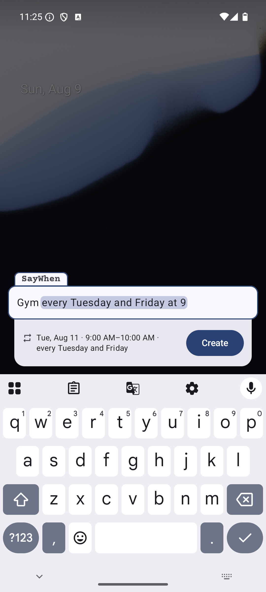
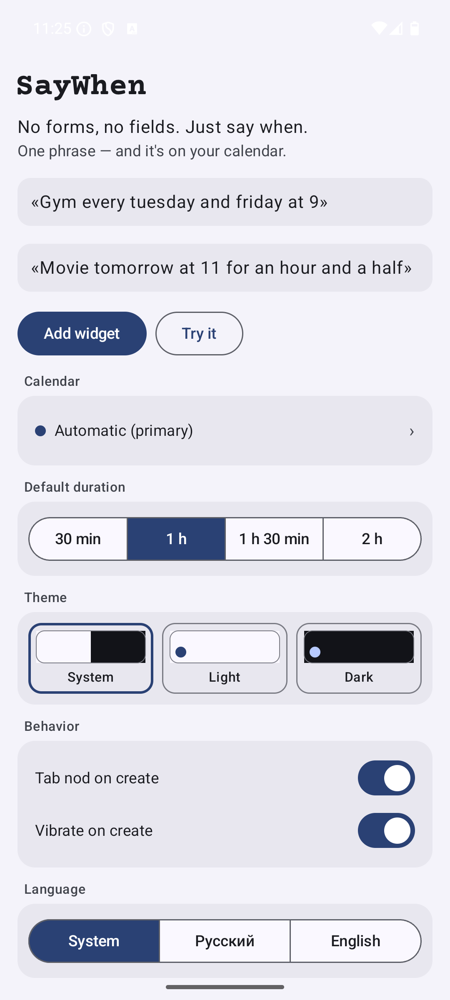
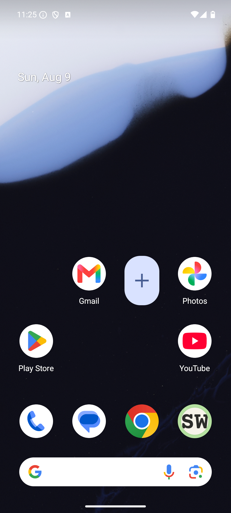

# SayWhen

**No forms, no fields. Just say when.**

One phrase — and it's on your calendar. Type it the way you'd say it,
in English or Russian:

> Gym every tuesday and friday at 9
>
> Movie tomorrow at 11 for an hour and a half
>
> Dentist june 3 at 12:30

SayWhen parses the phrase as you type — date, time, duration, recurrence —
shows a live preview of what it understood, and writes the event straight to
the calendar you chose. No account of its own, no server, no network access
at all: the app doesn't even declare the `INTERNET` permission.

| Input window | Settings | Widget |
|---|---|---|
|  |  |  |

## Install

Grab the APK from [Releases](https://github.com/dmi3dmi3/saywhen/releases)
and open it on the device (Android 8.0+). F-Droid — coming soon.

### Verify

Release APKs are signed with a key whose certificate SHA-256 fingerprint is:

```
522e011d3835ba12de4f8c1278783a567111fac7d2b5cf32e029cb21f2dc42ea
```

Check with `apksigner verify --print-certs app-release.apk`.

## Permissions & privacy

**Events go to your calendar — nowhere else.**

- `READ_CALENDAR` — list your calendars in settings and pick the target one.
- `WRITE_CALENDAR` — insert the event you asked for.

That's the whole list. No analytics, no crash reporting, no identifiers.
Details in [PRIVACY.md](PRIVACY.md).

## Building

```
./gradlew :app:assembleDebug
```

Kotlin + Jetpack Compose, two modules: `:parser` (pure JVM, the phrase
parser) and `:app` (Android). Without release signing credentials
`assembleRelease` produces an unsigned APK — that's expected.

## License

[GPL-3.0](LICENSE). Depends on AndroidX / Jetpack Compose (Apache-2.0).

## Mirror notice

This is a **read-only source mirror**: development happens in a private
repository, and each release lands here as a single source drop. Patches are
not accepted — pull requests will be closed. Bugs and ideas are welcome in
[Issues](https://github.com/dmi3dmi3/saywhen/issues).

---

# SayWhen (по-русски)

**Без форм и полей. Просто скажи когда.**

Одна фраза — и событие в календаре. Пишите так, как сказали бы вслух,
по-русски или по-английски:

> Спорт каждый вторник и пятницу в 9
>
> Кино завтра в 11 на полтора часа
>
> Стоматолог 3 июня в 12:30

SayWhen разбирает фразу прямо при вводе — дату, время, длительность,
повторяемость, — показывает живой превью того, что понял, и записывает
событие в выбранный вами календарь. Без своего аккаунта, без сервера и
вообще без доступа в сеть: приложение даже не объявляет разрешение
`INTERNET`.

**Установка:** APK на странице
[Releases](https://github.com/dmi3dmi3/saywhen/releases) (Android 8.0+);
F-Droid — скоро.

**Приватность:** события идут только в ваш календарь — больше никуда.
Подробности — в [PRIVACY.md](PRIVACY.md).

**Зеркало:** разработка идёт в приватном репозитории, сюда попадает срез
исходников на каждый релиз. Патчи не принимаются (PR будут закрыты); баги и
идеи — в [Issues](https://github.com/dmi3dmi3/saywhen/issues).
